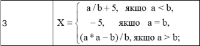
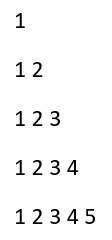

# Завдання 1

Написати програму, яка обчислює значення X  в залежності від значень a та b, введених користувачем з клавіатури. (У варіантах 1-10 числа a та b можуть бути лише додатніми, у варіантах 10-20 можуть приймати значення від 1 до 100. Реалізувати у програмі перевірку чисел a та b, введених користувачем) 

# Завдання 2

Написати програму, яка виконує дії згідно з Вашим варіантом.

### Знайти та роздрукувати перші 8 чисел з ряду Фібоначчі та їх суму.

# Завдання 3

Вводиться ціле число N (1<N<9), а виводяться рядки з числами або іншими символами (*, #), які утворюють визначений «рисунок» (останній задається варіантом).

