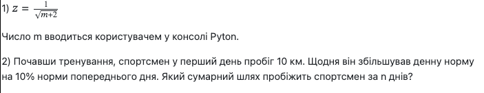

# Завдання 1

Реалізувати дві функції користувача в одній програмі.

# Завдання 2

Реалізувати функцію 2 із завдання 1 у вигляді окремого модуля, підключити її в основну програму і продемонструвати роботу з нею.

### Почавши тренування, спортсмен у перший день пробіг 10 км. Щодня він збільшував денну норму на 10% норми попереднього дня. Який сумарний шлях пробіжить спортсмен за n днів?

