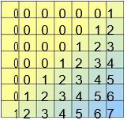

# Завдання 1

 Реалізувати одновимірний масив, довжину масива та сам масив користувач має ввести з клавіатури. Виконати над масивом обчислення, вказані  у Вашому варіанті.

### Дано одномірний масив, що складається з N дійсних елементів. Масив користувач має ввести з клавіатури. Обчислити середнє арифметичне від’ємних елементів масиву.

# Завдання 2

Заповнити двовимірний масив розміром 7x7 таким чином, як показано на рисунку згідно з Вашим варіантом. Вивести масив на екран. Для виконання завдання використовуйте цикли.

# Завдання 3

Реалізувати функцію, яка виконує операції над списками – задану за варіантом та друк списку на екран. Список користувач має вводити з клавіатури.

### Вставка елемента в список у вказану позицію.

# Завдання 4

Реалізувати функцію, яка виконує операції над списками – задану за варіантом та друк списку на екран.

### Пошук послідовності елементів.

# Завдання 5

 Реалізувати функцію, яка виконує операції над множинами – задану за варіантом та друк множини на екран. У випадку, якщо задану варіантом операцію над множиною виконати не можна, перетворіть множину у список, а потім при виведенні на екран результуючий список перетворіть на множину.

### Задано текст з цифр і літер латинського алфавіту. Скласти програму, яка визначає, яких літер – голосних {a, e, i, o, u, y} або приголосних більше в цьому тексті.

